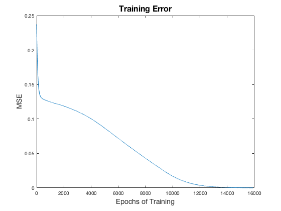
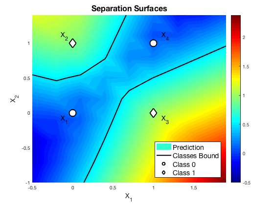

# Setting up the XOR problem

In this repository we show our simple implementation of a 2-layer ANN, just to give you some tips if you need (or would like) to design your own model. The code we present is basic and can be easily improved, but we try to keep it simple just to understand fundamental steps. In back-propagation we avoid for loops exploiting the Matlab efficiency with matrix operations. This is a key points and can substantially affect the running time for large data.

## Data definition
The classification task on the boolean function XOR is a common not-linearly separabile instructional Machine Learning problem. Input data can be defined as a matrix:
```matlab
   >> X = [0, 0, 1, 1; 0, 1, 0, 1]
   
   X =

       0     0     1     1
       0     1     0     1
   ```
To which we can assign the target:
```matlab
   >> Y = [0, 1, 1, 0]
   
   Y =

       0     1     1     0
   ```


## Network initialization

In our case for example, we save the variables of the network in a structure (named `nn`) for which we define three functions. [nnInit.m](https://github.com/alered87/First-Day-at-AI-lab/blob/master/matlab/2layer/nnInit.m) randomly initializes the weights and bias of the hidden (wH, bH) and the output (wO, bO) layers. Each input sample is assumed in column vector form, then the weights are organized in matrices with as many rows as the number of units in the layer (the desired number of hidden units in the hidden layer and the output size in output layer) and as many columns as the dimension of the input (the data dimension for the hidden layer and the number of hidden units in the output one). We can create a network to compute the XOR data passing the number of hidden units (10 in this case), the input and the output dimension to:
```matlab
 nn = nnInit(10,2,1)
 ```

The prediction of the network on data can be evaluated by  can by [nnEval.m](https://github.com/alered87/First-Day-at-AI-lab/blob/master/matlab/2layer/nnEval.m). This can be set by simple matrices multiplications, since the built-in Matlab functions which are used to compute the transfer function (i.e. _logsig_, _tanh_, etc) are vectorized (for example we implement the _ReLu_ activation by `max(A,0)`). The function [nnTrain.m](https://github.com/alered87/First-Day-at-AI-lab/blob/master/matlab/2layer/nnTrain.m) perform the training of the network with respect to the given input data and targets. We set up the training phase in an on-line setting via a for loops, but its straight-forward to implement a batch training by matrices multiplications. To start the training we have to provide as argument the structure containing variable (`nn``)), the defined input data `X` and its targets `Y`, the desired number of epochs of training and the learning rate, obtaing as output the trained structure:


```matlab
 nn = nnTrain(nn,X,Y,1000,0.001)
 ```
We can visualize the performance during training of the network w.r.t penalty dur on data by

```matlab
plot(n.Loss);
xlabel('Epochs of Training','FontSize',14)
ylabel('MSE','FontSize',14)
title('Training Error','FontSize',16)
```



and to have an idea of the prediction of the network on the input space we can plot the separation surfaces evaluating the network on a space gridding: 

```matlab
bound = [-.5,2;-1,1.5]; % axis bound
step = .3; % number of evaluation point

X = [ 0 0; 0 1; 1 0; 1 1]'; % input matrix
Y = [0 1 1 0]; % target matrix

% generating space grid
[xp1,xp2] = meshgrid(bound(1,1):step:bound(1,2),bound(2,1):step:bound(2,2));

% evaluation on space grid
f = zeros(size(xp1));
for i=1:size(xp1,1)
    for j=1:size(xp1,2)
        n = nnEval(n,[xp1(i,j);xp2(i,j)]);
        f(i,j) = n.o;
%         f(i,j) = n([xp1(i,j);xp2(i,j)]);
    end
end

pcolor(xp1,xp2,f); % plot of evaluation color
shading interp; % removing gridding from plot
colormap(jet); % setting colormap
hold on;
contour(xp1,xp2,f,[.5,.5],'LineWidth',2,'Color','k'); % drawing separation curve
% drawing data points 
scatter(X(1,[1,4]),X(2,[1,4]),200,'o','filled','MarkerEdgeColor','k','MarkerFaceColor','w','LineWidth',2);
scatter(X(1,[2,3]),X(2,[2,3]),200,'d','filled','MarkerEdgeColor','k','MarkerFaceColor','w','LineWidth',2);
% labeling data points
c = {'X_1','X_2','X_3','X_4'};
dx = [-.15, -.15, .1, .1];
dy = [-.1, .1, -.1, .1];
text(X(1,:)+dx, X(2,:)+dy, c, 'FontSize',14);
colorbar;

% plot labels
xlabel('X_1','FontSize',14)
ylabel('X_2','FontSize',14)

title('Separation Surfaces','FontSize',16);
h = legend({'Prediction','Classes Bound','Class 0','Class 1'},'Location','SouthEast');
set(h,'FontSize',14);
```

